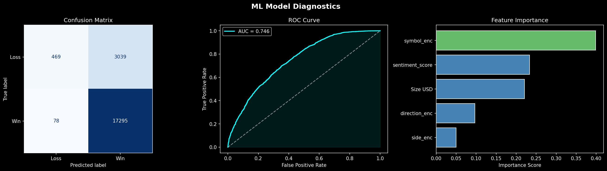

# 📊 Bitcoin Sentiment × Hyperliquid Trader Analysis
### Primetrade.ai Data Science Assignment — Atharva Umeshkumar Dubey

> **TL;DR:** Extreme Greed is the best regime to trade (89% win rate, $130 avg PnL). Symbol choice predicts outcomes 2× more than sentiment. Bottom 20% traders destroy their edge by oversizing during Fear.

---

## 📌 Assignment Brief

This project was submitted as part of the **Primetrade.ai Data Science hiring process**. The task was open-ended — no template, no guided steps — just two raw datasets and a goal:

> *"Explore the relationship between trader performance and market sentiment, uncover hidden patterns, and deliver insights that can drive smarter trading strategies."*

**The two datasets provided were:**

| Dataset | Description |
|---------|-------------|
| `fear_greed_index.csv` | Daily Bitcoin Fear & Greed Index classifications (Extreme Fear → Extreme Greed) from 2018 to 2025 |
| `historical_data.csv` | Raw trade-level data from Hyperliquid — a decentralised perpetuals exchange — including account, symbol, execution price, size, side, closed PnL, direction, and more |

The challenge was to merge these two unrelated datasets on date, then independently design and execute a full analysis from scratch — data cleaning, exploration, statistical breakdowns, visualisations, trader profiling, time-series analysis, a machine learning model, and finally distil everything into actionable trading strategies.

---

## 🧠 My Approach

Rather than just running summary statistics, I structured the analysis as a series of questions that build on each other — from broad market-level patterns down to individual trader behaviour and finally a predictive model:

1. **What does the data look like and how do we join it?** — Date-based merge, cleaning bad rows, engineering features like `is_profitable`, `sentiment_score`, and `pnl_bucket`
2. **How is sentiment distributed and where does trading activity concentrate?** — Fear days dominate the calendar (781 days) but Extreme Greed drives disproportionate PnL
3. **Does sentiment actually affect whether trades win or lose?** — Yes, strongly — win rates range from 76% (Extreme Fear) to 89% (Extreme Greed)
4. **Does the pattern hold across individual coins?** — No — coins behave very differently across regimes; some are regime-agnostic, others are highly sensitive
5. **Do better traders behave differently from worse ones?** — Yes — top 20% size down during Fear; bottom 20% oversize and lose more
6. **How has performance changed over time?** — Trade volume exploded in late 2024; win rates have been consistently above 50% since mid-2024
7. **Can we predict whether a trade will win before it closes?** — A Random Forest model achieves AUC 0.746; symbol is the strongest predictor
8. **What should traders actually do differently?** — 5 concrete, data-backed strategy recommendations

---

## 📁 Repository Structure

```
├── Primetrade_assigment.ipynb     ← Full analysis notebook (run top to bottom)
├── README.md                      ← This file
├── fear_greed_index.csv           ← Sentiment dataset
├── historical_data.csv.zip        ← Hyperliquid trades dataset (zipped due to size)
├── ml_diagnostics.png             ← Confusion matrix, ROC curve, feature importance
├── performance_by_sentiment.png   ← Win rates and PnL across sentiment regimes
├── sentiment_landscape.png        ← Sentiment distribution and timeline
├── symbol_analysis.png            ← Per-coin win rates and sentiment heatmap
├── time_series_trends.png         ← Rolling 14-day win rate, PnL, and trade count
└── trader_tiers.png               ← Top 20% vs Bottom 20% trader behaviour
```

---

## 🔍 Analysis Walkthrough

| # | Section | What I Did |
|---|---------|------------|
| 1 | **Data Loading & Cleaning** | Loaded both CSVs, audited missing values, parsed dates, merged on `Date`, removed zero-PnL rows (open trades), engineered `is_profitable`, `sentiment_score`, `pnl_bucket`, `symbol_clean` |
| 2 | **Sentiment Landscape** | Counted days per regime, mapped trade volume to each regime, plotted sentiment score timeline 2018–2025 |
| 3 | **Performance by Sentiment** | Computed win rate, avg PnL, median PnL per regime; broke down BUY vs SELL win rates; built stacked bar of Loss / Small Win / Big Win proportions |
| 4 | **Symbol-Level Intelligence** | Identified top 10 symbols by volume; plotted win rate per symbol; built a symbol × sentiment heatmap to find regime-sensitive coins |
| 5 | **Top vs Bottom Trader Profiling** | Aggregated per-account stats, filtered to ≥10 trades, labelled top/bottom 20% by total PnL, compared win rates and position sizing behaviour across regimes |
| 6 | **Time-Series Trends** | Built daily aggregations, computed 14-day rolling win rate and PnL, plotted alongside daily trade count to show platform growth |
| 7 | **Predictive ML Model** | Label-encoded categorical features, trained a Random Forest (200 trees, depth 8), evaluated with ROC-AUC, confusion matrix, and feature importance |
| 8 | **Strategy Recommendations** | Translated every major finding into a specific, actionable trading strategy |

---

## 📈 Key Findings

### 1 — Extreme Greed is the most profitable regime
Extreme Greed delivered the highest win rate **(89%)** and highest average PnL **($130/trade)** totalling **$2.71M**. The instinct to "sell the top" costs money — momentum works here.

### 2 — SELL trades structurally outperform BUY trades
SELL trades beat BUY trades in **every single sentiment regime**. This is a consistent edge across the entire dataset, not a regime-specific anomaly.

### 3 — Bottom 20% traders oversize during Fear
Bottom 20% traders averaged **$12K per trade** during Fear vs Top 20%'s **$9.2K** — they bet bigger and lost more. Sizing discipline is the clearest behavioural separator between elite and poor traders.

### 4 — Symbol choice is the dominant predictor
The ML model found **symbol importance: 0.40** vs **sentiment: 0.23**. Which coin you trade matters nearly **2× more** than when you trade it.

### 5 — Meme coins are extremely regime-dependent
FARTCOIN win rate swings from **16% (Extreme Fear) → 97% (Extreme Greed)** — a 6× swing. Rotating into regime-appropriate coins adds massive alpha vs holding a fixed portfolio.

---

## 📊 Performance Summary Table

| Sentiment | # Trades | Win Rate | Avg PnL (USD) | Total PnL (USD) | Avg Size (USD) |
|-----------|----------|----------|---------------|-----------------|----------------|
| Extreme Fear | 10,406 | 76.0% | $71 | $739,110 | $5,468 |
| Fear | 29,808 | 87.0% | $113 | $3,357,155 | $8,041 |
| Neutral | 18,159 | 82.0% | $71 | $1,292,921 | $5,556 |
| Greed | 25,176 | 77.0% | $85 | $2,150,129 | $5,439 |
| **Extreme Greed** | 20,853 | **89.0%** | **$130** | **$2,715,171** | $2,780 |

---

## 🤖 ML Model

**Goal:** Predict whether a trade will be profitable before it closes, using only information available at trade entry.

**Algorithm:** Random Forest Classifier (200 trees, max depth 8, min 20 samples per leaf)

**Features used:** Symbol, Sentiment Score, Trade Size (USD), Direction (open/close event), Side (buy/sell)

| Metric | Value |
|--------|-------|
| ROC-AUC | **0.746** |
| Top Feature | symbol_enc (0.40) |
| 2nd Feature | sentiment_score (0.23) |
| 3rd Feature | Size USD (0.22) |

An AUC of 0.746 means the model correctly ranks a winning trade above a losing trade 74.6% of the time — well above random (0.5). The primary limitation is class imbalance (~85% of trades are wins); future iterations would benefit from `class_weight='balanced'`, threshold tuning, or SMOTE to improve loss detection.



---

## 🗺️ Strategy Recommendations

**Strategy 1 — Follow Extreme Greed, Don't Fight It**
Align with momentum during Extreme Greed. Use trailing stops to capture upside while protecting gains. Don't "sell the top" reflexively.

**Strategy 2 — Default to SELL Side**
SELL trades outperform BUY in all 5 regimes. Build a systematic bias toward short opportunities. *(Note: directional confirmation recommended to rule out data recording artifacts.)*

**Strategy 3 — Size Down During Extreme Fear**
Reduce position size during Extreme Fear (76% win rate, lowest avg PnL). The "buy the dip" instinct leads to oversizing at exactly the wrong moment.

**Strategy 4 — Sentiment-Conditional Symbol Rotation**
Rotate into regime-appropriate coins. ETH is best in Extreme Fear (99%) but drops to 60% in Greed. FARTCOIN is only viable in Greed+ conditions. XRP peaks at Neutral (100%).

**Strategy 5 — Hold SUI and HYPE as Core Positions**
SUI and HYPE maintain high win rates across all 5 sentiment regimes (SUI: 94/89/97/97/92%, HYPE: 86/90/84/91/97%). These are regime-agnostic performers — ideal as core holdings regardless of market mood.

---

## 🛠️ Tech Stack


---

## ⚠️ Data Notes

- **Leverage:** The leverage column was absent after merging the two datasets. It would be incorporated in future iterations as it likely adds significant predictive power to the ML model.
- **Class imbalance:** ~85% of trades are wins. The confusion matrix reflects the challenge of predicting the minority loss class; future work would address this with `class_weight='balanced'` or SMOTE.
- **Date range:** Hyperliquid trades span late 2023–May 2025; the sentiment index covers 2018–2025. Only overlapping dates were used after the inner join.

---

*Analysis by Atharva Umeshkumar Dubey | Primetrade.ai Data Science Hiring Assignment*
